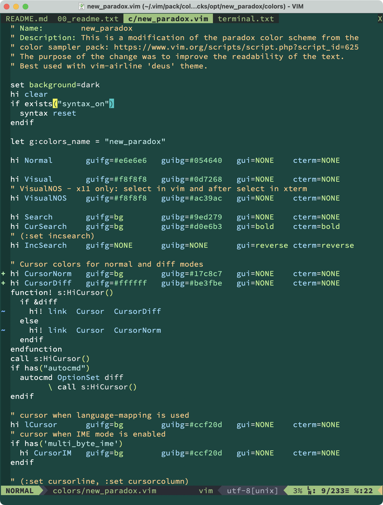
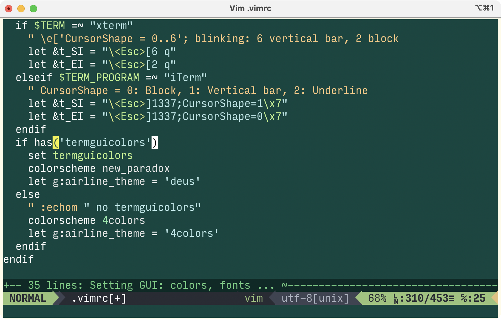

---------------------------------------------------------------------------
## new_paradox.vim

* Vim color scheme with a dark blue-green background
  [(see screenshots)](#screenshots).
  It is intended for GUI or true-color terminals.

* This is a modification of the Paradox color scheme from the
  [color sampler pack](
  https://www.vim.org/scripts/script.php?script_id=625).
  The purpose of the change was to improve the visibility in terms
  of readability of the edited text.

* Best used with Vim-Airline **deus** theme.

---------------------------------------------------------------------------
## Installation

* Vim 8 built-in package, see `:help packages` and search for
  `colorscheme`.

* Loaded with `:colorscheme new_paradox`.

---------------------------------------------------------------------------
## Usage Notes

* This scheme, as well as the original one, goes surprisingly well with
  the **deuce** theme of the Vim-Airline package.

* I use the [Rainbow plugin](https://github.com/luochen1990/rainbow)
  to display matching brackets. I would recommend the following settings
  for the `new_paradox.vim` color scheme:
  ```
  " light gray, pale turquoise, yellow, light green, pink, dark orange
  let g:rainbow_active = 1
  let g:rainbow_conf = {
        \  'guifgs': [ '#e6e6e6', '#afffff', '#d7ff00',
        \              '#87ff87', '#ffafd7', '#ff8700' ],
        \  'ctermfgs' : [ 254, 159, 190, 120, 218, 208 ],
        \	 'operators': '',
        \	 'separately': {
        \      'cmake' : 0,
        \	 }
        \}
  map <F9> :RainbowToggle<CR>
  ```

* By default, I chose the colors of the terminal emulator built into Vim
  to be the same as in the 'Normal' highlighting. However, if you prefer
  a terminal with a light background, set the following variable
  before calling the `:terminal` command:
  ```
  let g:paradox_term = 1  " light background, -1 for dark bg.
  ```

* Recipes for those who want to change some colors in the scheme:
   ```
   function! s:override_new_paradox()
     " Castomization for new_paradox
     hi CursorNorm guifg=bg guibg=white gui=NONE cterm=NONE
     hi Comment cterm=italic gui=italic
   endfunction
   if has("autocmd")
     autocmd ColorScheme new_paradox
           \ call s:override_new_paradox()
   endif
   ```
  [More detailed instructions here.](
https://github.com/vim/colorschemes/wiki/How-to-override-a-colorscheme%3F
)

---------------------------------------------------------------------------
## Screenshots
\
_Screenshot of MacVim window with new_paradox color scheme_

\
_Screenshot of iTerm2 window with new_paradox color scheme_

---------------------------------------------------------------------------
## Notes on "Good Readability"

1. Contrast

   As one of the criteria of readability, I used the concept of contrast
   between the text color and the background color. The estimate of such
   contrast was carried out using two methods:
   - [WCAG 2.x contrast ratio calculation](
   https://www.w3.org/TR/WCAG20/#contrast-ratiodef)
   - [Advanced Perceptual Contrast Algorithm](
   https://github.com/Myndex/SAPC-APCA)

   The implementation of both algorithms is contained in the Python
   program [`tools/contrast_rgb.py`](tools/contrast_rgb.py)

   Good readability of text depends not only on the chosen colors, but
   also on many other factors. Font type, font size, screen resolution
   and rendering algorithm all affect the visibility and therefore
   readability of text. I used the following fonts with this theme:
   * MacOS, Retina XDR display
     + `MacVim:         guifont=Source\ Code\ Pro:h16`
     + `vim in iTerm2:  Input Mono Narrow Regular; 17`
   * Linux, X11, 96dpi LCD
     + `gvim:           guifont=Source\ Code\ Pro\ Regular\ 12`
     + `vim in xterm:   Input Mono; faceSize: 12`

   The particularities of each individual's personal perception of colors
   are also important. A very good article by Andrew Somers on this topic
   is [*The Realities And Myths Of Contrast And Color*](
   https://www.smashingmagazine.com/2022/09/realities-myths-contrast-color/
   ).

   The contrast for graphic elements such as cursor, fold-line etc. may be
   low and preference is given to good visibility of the text on them.

2. Do the colors matter?

   * Are colors necessary for syntax highlighting? Will they interfere
     with the perception and readability of the program?

     My short answer to both questions is no. Syntax highlighting colors
     are not required, but they should not make the program or text
     difficult to understand. It seems to me that in this context, the
     color highlighting resembles calligraphy.

     However, some people do not like syntax highlighting, and there are
     some good reasons for that, such as in the article
     [*A case against syntax highlighting*](
     https://www.linusakesson.net/programming/syntaxhighlighting/
     ) by Linus Åkesson.

     _An example is the nice monochrome 'quiete.vim' theme,
     which is part of the Vim 9.1 color scheme set._

   * How many colors should a good theme have? Is it not better to use
     fewer colors, but with better readability for each?

     I like the minimalist style, but it's hard to follow. I used eight
     colors for syntax highlighting in the 'new_paradox' scheme
     and my attempts to reduce the number of colors failed.
     It seems impossible to achieve a perfect match of one color theme to
     the syntax of different programming languages.

     _However, there are good minimalist themes, for example
     ['4colors.vim'](https://github.com/mihaifm/4colors)
     which uses only four colors for everything._

---------------------------------------------------------------------------
